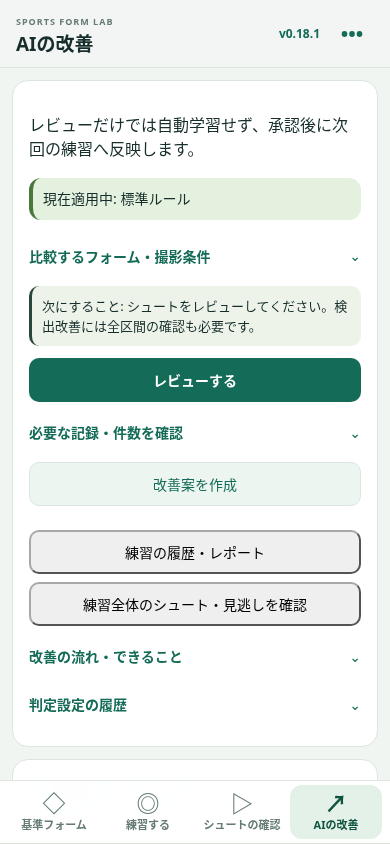
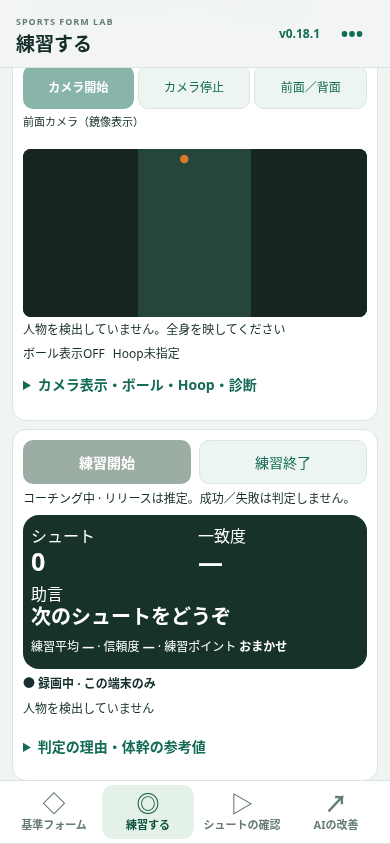

# v0.18.1：iPhone向け画面と評価

PR #6とPR #8はマージ済みでした。mainの6b9ba68から追加変更を作成し、既存のVersion・サムネイル・前面カメラ・Hoop候補を再利用しています。

## 画面の変更前後

| 変更前（v0.18） | 変更後（v0.18.1） |
| --- | --- |
| サイトのヘッダー、説明、上部タブと長いページ | 小さい固定ヘッダー、現在の画面名とVersion、4つの固定ボトムナビ |
| 補助機能はタブ下の「その他」 | 右上の「•••」から成長・履歴／Report・Single Shot・Session・動画／メモ |
| Good Formの登録フォームと説明が常時表示 | 現在の基準と画像・管理ボタンを優先。別の登録と撮影の説明は展開 |
| 練習開始前に設定が長く表示 | 設定は閉じて開始。カメラと判定／助言／操作を優先。横画面は左右配置 |
| フォーム項目の修正には詳しい画面をスクロール | 「フォーム・助言を評価する」を展開し、プルダウン→評価を保存 |
| Hoopは候補範囲の再指定のみ | 候補／確定枠を直接ドラッグし、位置を補正→再確定。大きさは2点／範囲指定 |

共通UIを`app-shell.js`と`app-ui.css`に分離し、推論・データ保存から独立させています。カード、入力、ボタンの表示を統一。44px以上の操作、下部・左右Safe Area、動的viewport、縦横対応。Safariバー・拡大文字・短い横画面では必要なスクロールを許し、無理に情報を隠しません。Swift等への移行やネイティブアプリそのものを実装したわけではありません。

## 操作

### Good Form

下の「基準フォーム」→現在の基準を確認。「登録済みGood Formを管理・選択」で変更。「別のGood Formを登録」を開くと動画選択・分析・登録ができます。動画がない／読めない場合は文字表示です。サムネイルは実際に読み込めたフレームから生成します。

### 練習する

下の「練習する」→必要なら「練習の設定」で基準・音声・録画などを変更→カメラ開始→練習開始。初期カメラは前面、背面への切替を維持。練習終了後にSession Report、そこから成長の記録へ進めます。成長の記録／履歴は右上の「•••」からも開けます。

Hoopは撮影開始時に色・形の候補を最大3回・1秒間隔で探索します。黄色破線は未確定で、認識済みとは扱いません。枠をドラッグして位置を直し、カメラ設定内の「この位置で確定」を押します。水色実線は人が確認した位置です。大きさが違う／候補なしなら「Hoopを手動指定」で2点タップ／ドラッグ。回転・解像度・カメラ切替で解除されるので再指定してください。検索・候補は採点や成功率へ使いません。

### シュートの確認

下の「シュートの確認」→動画を確認→指摘は正しい／違う等を選んで保存・次へ。既存1〜2タップ操作を維持しています。

フォーム自体や助言の質を追加評価する場合は「フォーム・助言を評価する」を開き、プルダウン→「評価を保存」。詳しい修正、実際の成功・失敗、コーチ原文、修正取り消しも維持します。入力中に次へ進むと保存を促し、未保存のラベルを動画範囲編集で失わないようにします。

### AIの改善

下の「AIの改善」で現在適用中の設定と次にすることを確認。「必要な記録・件数を確認」で不足件数と用途を開きます。練習＝保存セッション、実シュート＝全区間で確認した本数、助言レビュー＝有効な評価を付けたシュート数です。改善用と確認用は別の練習で、各用途最低2練習、改善用20本／件・確認用10本／件。各練習に20本必要という意味ではありません。

レビュー→改善案を作成→変更前後を確認→明示承認→次の練習へ反映。レビューだけで自動学習しません。改善が確認できないと推奨しません。元のForm Match、MediaPipe自体、腰の指標は最適化しません。判定設定の履歴から以前の設定へ戻せます。

## 「悪い」の意味とAIでの扱い

ユーザーの指定に従い、フォーム項目とAI助言の両方に追加しました。

| 評価 | 保存値 | 意味・利用 |
| --- | --- | --- |
| フォーム項目の悪い | `labels.submetrics.<項目> = bad` | 問題はあるが浅い／深い等の方向を未指定。項目ごとの自己申告件数を集計。方向や閾値を推測せず、これだけで改善案を作らない |
| 助言の悪い | `labels.feedbackRating = bad` | 役立たない。元の助言と同じ意味の助言に対する否定的な検証材料。別の未評価の助言を正しいとは扱わない |
| 助言の不正確 | 既存の`inaccurate` | 指摘内容が誤っているという既存評価。悪いとは別の項目で保持 |
| Form Matchへの納得度 | 既存のagree／disagree／unsure | 数値への同意。フォームの品質や助言評価と混同せず、選択肢を維持 |

低信頼度、シュートではない、条件違い、音声なしは従来どおり音声改善の有効データから除きます。個別指摘が正しくても、全体として役立たないという評価は両立できるので、元の助言の同じ内容を検証するときは明示した助言全体の「悪い」を優先します。方向を推測した閾値候補は増やしません。改善案は引き続き独立検証と承認が必要です。

旧ラベルを変換しません。IndexedDB v4のまま、初期化・削除なし。JSON v1の許容値を追加し、現在のラベルと修正履歴が往復可能です。追加前の古いアプリは新しい値を解釈できないため、新ラベル入りバックアップはv0.18.1以降で復元してください。旧バックアップはそのまま読めます。

## モデル調査と制限

[既存のモデル・ライセンス調査](issue-7-compact-ux.md)を引き継ぎます。Roboflowの指定ページはこの環境の通信制限で確認できず、専用重み・画像の利用許諾と容量を確定できませんでした。Ultralytics inferenceはAGPL-3.0、ONNX Runtime WebはMITでSafari iOSのWASM実行候補ですが、ランタイムの許諾とモデル／画像の許諾は別です。実際のHoopモデルの精度・iPhone速度・電池・発熱は未測定です。

今回の色・形処理は追加重み0バイト、追加API・映像送信・秘密鍵なし。同色背景を誤認し、小さい・白い・暗い・隠れたリングを見逃します。人の確認が必要です。自動探索を成功判定や専用AIとして表示しません。将来、許諾の確かな専用重みを得たらWASM等でPose並行時の実機FPS・メモリ・発熱を測って導入を判断します。

## 実機iPhone Safari確認

実機Safari・VoiceOver・カメラの物理入力・発熱／電池は未検証です。サイトデータを消さず、変更を確認できるHTTPS環境で次を確認してください。

1. 全タブのv0.18.1、ボトムナビ、Safariバー／Safe Area、縦横・文字拡大・VoiceOver。右上メニューと戻り先の画面名。
2. 旧Good Form・動画・姿勢・レビュー・判定設定・Report／Progressが残ること。通常ブラウズで既存の保存データを使うこと。
3. Good Form登録・管理・ReviewのMP4／Safari録画サムネイル、0秒・終端・短い動画・欠落・タブ移動。
4. 前面／背面の人物・Pose・ボール・Hoop位置の一致、カメラ切替・回転で古い矩形が消えること。
5. Hoop探索、同色背景、候補なし、直接ドラッグ、手動範囲変更、明示確定、確定後の検索停止。10分練習でFPS・音声・録画・発熱・電池。
6. フォームと助言の「悪い」を保存し再読み込み。レビュー集計・JSONバックアップ・修正取り消し、元の点数保持。
7. AIの不足件数、別練習による検証、承認前不適用、承認・次回反映・以前の設定への復帰。動画切り出し・保存・共有も確認。

## テスト結果

- `npm test`: 17テストファイルすべて成功。「悪い」のJSON／修正履歴・集計・元の点数保持、助言への否定的な検証、方向未指定のフォームから最適化しないケースを追加。
- `npm run build`、`git diff --check`: 成功。
- Chromium `check-native-ui`: 固定ヘッダー／Version／4タブ／その他メニューとEscapeのフォーカス復帰、320/390/430px縦・844x390横、44px、両方の「悪い」の保存・再読込・JSON・件数・取り消し、点数／旧設定保持、requestSubmit非対応時の保存を確認。
- `check-issue-7`: 実フレーム／欠損動画、前面鏡像・背面・フォールバック、自動候補・直接タッチドラッグ・手動範囲・明示確定・回転・検索停止、AI不足時不適用。
- 既存 `check-issue-1` / `check-issue-3` / `check-issue-5` / `check-shot-review` / `check-personal-calibration` / `check-live-coach`: 成功。1〜2タップ、独立検証・承認・復帰・競合防止、旧DB／レビュー／原文／姿勢バックアップ、Report／Progress、録画・1本クリップ、日英音声・OFF・カメラ終了。設定の折りたたみに合わせテストの操作だけ調整しました。助言の位置は画面内だけでなくボトムナビより上であることを検証しています。

時刻確認の保存中に次の記録を開けて入力欄が更新される競合も修正しました。保存中の表示と操作抑制を追加し、連続する4練習の入力→検証→承認が完了することを確認しています。カメラ拒否などの状態は画面にも表示し、動作中の重複した説明は非表示にします。

## 画面例

生成した検証用映像・記録のChromium画面です。実機iPhoneの写真や実際の練習データではありません。

